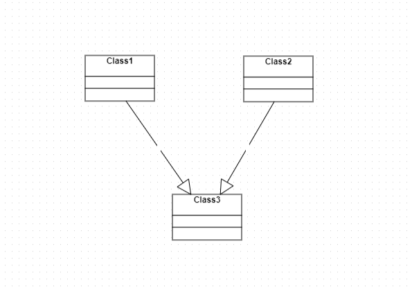

## Doxabeta Neo Documentation

### About Doxabeta Neo

**DoxaBeta Neo** is a case tool used for business modeling (analysis of business-processes, reengineering of business processes) and object-oriented design of software and databases. DoxaBeta Neo is a [product of DoxaBeta](https://doxabeta.com/).

### Quick Start

## Registration and logging in to DoxaBeta Neo

The following steps must be followed for one to be able to register and log into the portal:

1. User needs to open the portal Doxabeta-neo.com
2. User needs fill the registration part with a real email address and name. Please note to select the checkbox "I am not a Robot", then proceed to click on the register button. 
3. The system displays a notification that an email is sent. Open your email to find a letter from no-reply@doxabeta-neo.com where there is a link to verify your email. 
4. Click on the link to verify your email. There will be a notice "verification successfully completed". click on ok. After this another email with a password for login.
5. Copy the password and use for logging in to the system.  

After logging in to the system you will see these:

* All Projects - In this section there is a list of all created projects.
* My license and Request - This section contain all request user makes. 
* User Profile 
* doxabeta.com -  This is the homepage of [doxabeta](https://doxabeta.com/)
* Docs - This is the documentation section. This button opens the website with product documentation of Doxabeta Neo. 
* Chat - Here is a room where you can ask questions about working with the Doxabeta Neo, its development and documentation. The questions are answered by competent specialists who are always ready to help and support.

## Creating a New project

To create your first project click All projects on the main page. A page will be displayed for you to create a new project. Click on New project to open the creation form of the project.

* Project name - it is advisable to name the project so that it is clear which application you want to create. It should be brief and succinct.

* Short project name - is how the project will be called in the team. Perhaps the abbreviation or the purpose of the project. If left blank, the field will be created automatically by the project name. Short project name of the project should be in English or written in Latin.

* Access – who will be able to view and edit the project.
* Description – brief description of the project.

The system do not only allow creating on new project but also to import already existing projects. For this option click on "choose files" from the field create a project based on saved file. After all fields are filled in, the project can be saved. Later this data can be edited. 

## A brief overview of doxabeta Neo 

When you create a project, open the Application model page, which is a list of the classes (essentially, a set of elements) that describe the domain of the application and its functionality. Doxabeta Neo allows you to create different types of classes from simple entities (application objects) and forms to private types and business servers. Classes can also be created during creation of the diagram. Diagrams allow not only for you to create classes, but also to establish relationship between them, which in the future will allow to associate different forms in the application. Also, some types of diagrams help to detail the subject area, to describe the processes that must be implemented by the application. Naviagtion allows you to create a menu of the application to distribute forms groups and/ or roles. Generation allows you to create a working prototype application, which is suitable for the initial demonstration to the customer. On this basis the application is easy to modify in accordance with the wishes of the customer as the main points of the subject area had been introduced. The ap can be configure in accordance with the needs of your application, specify the path generation for client and server parts of the application, to Supplement the description. Also the settings menu option allows to delete the project

## Generation settings
If needed, generation can be splited for client and server parts. The server part is usually used for “complex” algorithms, so not to overload the user interface. The client part is needed to process fast tasks. Login, password for the client part repository and branch for the client part, as well as similar fields for the backend part are used if you need to generate an application in an existing repository. If you do not have a repository yet, the designer will create a new repository on Githab by the project name (it will generate and bind ssh keys), and generates code in the created repository. In addition, the project may be published in gh-pages. It is also possible to change localization (the language which the designer displays) and the theme designer. To export project need to open the Settings page and under Project Action with the project to choose I want to export project. You can also make backup project, click the button I want to do Project backup.

## Basic type of diagrams 
The first step of an algorithm for designing an information systems is a problem statement, which should be defined:

+ characteristics of the automation object
+ define the main task to be implemented by the application
+ describe the business processes that will be implemented in the application

Next is to create a diagram of Use Cases, which is the most common representation of functional requirements of the system. It allows to describe the main processes that is needed to be implemented. It is useful to make an activity diagram, which is a flowchart that shows the flow of control passes from one activity to another. Once the functional requirements for the system and its boundaries is defined, user should examine the subject area with the aim of building class diagram. Further, it is useful to describe scenarios that is needed to be implemented in the application using sequence diagram. Scenarios can be described using chart cooperation, allowing to describe the interaction of objects and focuses primarily on the organization of the objects. State diagram determines the sequence of States of an object caused a sequence of events. This diagram may help to clarify the subject area, supplemented, if necessary, a class diagram. Chart deployment is a physical diagram in the UML. It displays the physical relationship between hardware and software components of the designed system.

## Sterotypes of classes 
+ Entities (implemtation) - This is the class that represent real object whose instaces will be stored in the appplication database. Create pair.
+ Enumeration (enumeration) - Is a datatype which is defined as an identifiers. Create pair.
+ Business server(businessserver) - This is a class whose code is invoked in the process of changing instances of related entities.
+ Type (type) – This is a complex data type or a real object whose instances will be stored in the application database. It is advisable to create, if necessary in code, secondary business objects that do not need to be stored in the database.
+ Typedef (typedef) - This is a type of data that can be mapped manually generated to the database or application data types. Needed if there are not enough default types.
+ Interface (interface) - This contract in the form of a list of public properties and methods that must be implemented in the related entities or types.
+ Application (application) - A class that stores general information about the generated application.
+ User forms (userform) – class representing an empty form of application (all markup and logic for it to be done fully manually by the developer), which can also be added to the menu structure (in “container” class with the stereotype “application”). It can be used in the case when the level of the application model required special forms, which are neither list nor edit forms (so that looking at the model it can be seen which forms are in the application)
+ Geo-server layer (geolayer) - Class which configures the layer GIS subsystem.
+ Geo-server layer styles (geolayerstyle) - class which configures the layer GIS subsystem.
+ External entities (external) – a class that is not explicitly declared in the model but will be available in the source code, including an entity from a different project. When generating code level, it is assumed that the declaration of this class is contained in an external or system library.  In a particular case, it is implied that you can specify for an external class a reference to a class from another project (stage) in Doxabeta Neo. In this particular case, it is assumed that the class at the code level is declared in another solution (addon), which must be connected by developers to the main project manually (for example, through a NuGet package created on the basis of another solution; the connection of "external" libraries at the generation level is not implied). When it is used: a reference to a class from other projects (i.e. stages) is indicated when there are some common libraries for several projects, and classes from it are reused in different projects. Another option is that the corresponding external class is a class from the system library or any external library (addon). Then, at the model level, it is possible to link to an external class and include it in the base class representation, and at the code level, after generation, the data type for the corresponding property will be the class that is declared in this "external" library (it must be connected manually by the developer to the project; if it is a class from a system assembly, for example, then it can already be automatically connected as an option at the first generation of the project).
+ Entities with user stereotypes with user-defined (custom) - class with arbitrary semantics, which it code is not generated to the application.

The list of diagrams contains automatically created diagrams for each class. In the search field on the Application Model form enter the name (or part of it) of the class from the list. Select the class (or several classes) that meets the specified condition displayed. In the All types field, select any of the created types. Only classes of the selcted type are displayed.

## Filtering and searching charts
The diagram menu contains all diagrams created within the project. They differ in types and have unique names. If the list is long, it is convenient to use search or filtering. To search for diagrams, you can type part of the diagram name in the search field. The list will be edited in accordance with the specified condition. You can also filter the diagram by type. For this drop down list, select the desired diagram type.

## The basics of working with class diagrams

Class diagram from analyst and after object of design
When communicating with the customer, the analyst uses diagrams to represent an idea of the subject area, which is subsequently clarified and supplemented by the developer in accordance with the requirements of the architecture and the generation of the future project. A project with diagrams from the analyst usually contains in the title the specification, and the developer’s project, Implementation.

The developer details the subject area so that:

+ there are no many-to-many links (intermediate classes are added),
+ there are no aggregation type relationships (only association, composition, and inheritance can be used), as well as one-to-one multiplicity relationships,
+ all attributes have been assigned the data type necessary for storage and processing,
+ there are no contradictions in the structure of the diagram, which can lead to generation failures,
+ classes have been categorized by type (entity, enumeration, custom type, etc..)
+ the diagrams are distributed in catalogs specifying the purpose of classes (reference books, description of a specific group of classes, for example, personalities, territories, etc.),
+ methods are written for the class, if they are needed at the design and prototyping stage of the application.

The developer also creates forms and representations for the subsequent generation of a prototype of the future application. A class can have different sterotypes: entity, application, enumeration, etc.  Relationships are mainly established between entity classes (implementation). Also, a relationship can be established between an entity and an interface or an external interface.

## The properties of an Association

+ Description of relation – explanation of the connection (e.g. what it was or why exactly this).
+ Master class role name – the name of the role from the main class, duplicate role name in the diagram.
+ Publication name for master class this is the name of the main class property in the OData interface (it is a web-oriented API for accessing and manipulating data).
+ Multiplicity of master class – can be 0..1 (then in the database for the primary class value of the main class may be Null) or 1 (then in the database for the primary class value of the main class can only be Not Null).
+ Master class access modifier - This is protected (#),that is, access is restricted to the class or type containing the class; public (+), that is, the property is public; private (-), that is, access to the property is restricted. 
+ Master class role name - This is the name that will appear in the main class in the table. For example, for the table Order it will be the Storekeeper.
+ Publication role name for master class is the name of the properties of the main class in the OData interface.
+ Multiplicity of Master class this is * any value.This option supports only for generation. If you need a specific value that is different from *, it is necessary to control in code.
+ Autogenerated TypeUsage – identifier for an attribute that restricts the list of types in the inheritance hierarchy.
+ TypeUsage - an attribute that restricts the list of types in the inheritance hierarchy to which this relationship applies. When using inheritance, there is a problem of determining the right type when using an association.In other words, if the type master is an inheritance-associated type, it is not clear which particular type of the inheritance hierarchy is the master. Class A has a master M, from which there are at least two heirs: M1 and M2. To resolve the problem, you can use special metadata that allows you to specify that a property M (link to the artisan class) in the class data A, in this particular (practical) case, can take only values of type M, and also M1 and M2. This is done at the level of program code. 
Accordingly, if a data object (an instance of class A) that his master could be an instance of any of the classes M, M1, M2. 

+ Name of connection to database is the name of the field in the database in which to store a reference to the master

## Propeties of composition
+ Connection description - explanation of connection(e.g. what it was or why exactly this).
+ Aggregator Role name – the name of the role from the beginning of the composition that duplicates the role name in the diagram.
+ Publication role name -  for aggregator is the name of the aggregator properties in the OData interface.
+ Detail role name - the name that will appear in the main class in the table. For example, for the Order Status table, this will be an Order..
+ Detail Publication role name is the name of the aggregator properties in an OData interface
+ Multiplicity in aggregator is always 1, as in the case of compositions in the database for the primary class value of the master can not be Null.
+ Auto-generated aggregator TypeUsage – similar to the same property of the Association.
+ Aggregator TypeUsage – similar to the same property of the Association.
+ Connection name to Database is the name of the field in the database in which to store a reference to the master
+ Autogenerated child TypeUsage – similar to the same property of the Association.
+ Detail TypeUsage – similar to the same property of the Association.

## The attributes and attribute types data classes

Class attributes can be edited from the list of classes in the application model (app Model-group Entities – class click – edit) and charts (Charts-corresponding class diagram-a class is selected-the button edit (icon) – opens the same edit form class). The attribute has name (how it will be displayed in DB and code), caption (as the name will be displayed in the app), description (for example, for which this attribute) and the type. The attribute can be stored and unstored (in this case, its value is calculated in application code and is used for operations in code, without storing in DB). The attribute type must be specified because it is necessary to store data in the database and operations in the program code. Doxabeta Neo uses built-in data types (string string, int – integer, double point, bool – logical, etc., also there are types to store null values and the ability to create their own type)

## The types of relationships between classes and non-obvious restrictions of the object structure
The class whose multiplicity is equal to 1 (in rare cases 0..1 for an association) is the main, that is Master. For example, a shelf and a product on a shelf: there may be many products on one shelf, but the same product cannot lie on different shelves (it is the product, not the type, that is, a specific book, pen, jar, etc.). This connection will be associative, because if the shelf breaks, the product can simply be moved to another. The situation will be quite different with the house and an apartment.There may be many apartments in one house, but a particular apartment always belongs to one house, it cannot be moved to another. Accordingly, if the house disappears, the apartment will also not be. This is referred to as composition. Accordingly, a class whose multiplicity can range from 0 to n will be subordinate, that is, detail class. Classes in relations can be assigned a role (set a name for the foreign key of the database). In the example of the Warehouse application (example of building a Class Diagram) such roles have relations from the Employee class (Manager, Storekeeper, Accountant). The name of the role will be used to name the column in the details’s table for the master table. Show in the class diagram

## Limitations when constructing class diagrams
1. Detail of any level cannot be the heir of a master class, since in such a case the object of the heir must include itself

2. The heir from the detail class cannot be the detail of the heir of the master class.

3. You cannot do loops in inheritance

4. You cannot inherit a class from more than one class (a class may have many heirs but only one parent).

